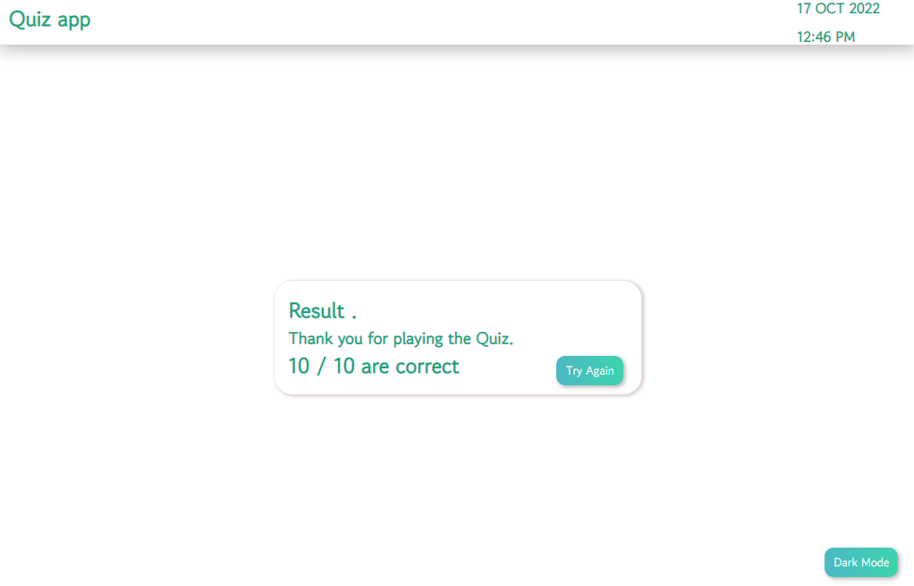

# Simple-Quiz-Aplication
<!--  -->
<h1>Light Mode.</h1>
<!-- 
 -->
  
<h1>Dark Mode.</h1>
<!-- 
 -->
  
<h1>Result.</h1>
<!-- 
 -->
  
<h1>Mobile view.</h1>
<!-- 
 -->
 
<h1>Mobile Result view.</h1>
<!-- 
 -->
 